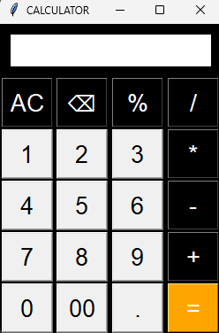

# CALCULATOR WITH GUI
**Demo Video** : <url>
## DESCRIPTION:
**About:**
        🧮 This is the basic ***Calculator with Graphical User Interface***. It is able to calculate basic arithmatic operations like addition, substraction, multiplication, division, and also percentage. It uses **Object Oriented Programming** structure to do operations.



### Features:
* Graphical User Interface using Tkinter.
* Basic arithmatic operations.
* Backspace and clear functionality.

### Installation:
Clone the repository
```bash
 git clone https://github.com/Ranajit08/Calculator_with_GUI.git 
```
### Usage:
To run the program, open terminal and run - 
```bash
python main.py
```

### Testing:
To test codes, install pytest module to test, if you already installed this test module in you desktop or laptop, skip this part - 
open terminal and run -
```bash
pip install pytest
```

for testing `main.py`, run -
```bash
pytest test_main.py
```
for testing `calculator.py`, run -
```bash
pytest test_calculator.py`
```

### Author:
- Ranajit Mitra
- GitHub: @Ranajit08

### LICENSE:
This project is licensed under the [MIT License](LICENSE).


